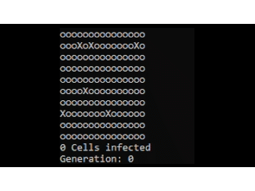

<---- Click to download

# Infection-Simulator

This is code for an infection simulator.

Runs only in console, however I may work on making it graphical.

Video Demo: 

# Running

To run this on windows, download the .exe file and then run it.

To run this on linux, download the .py code then in the terminal type: `python3 Infection.py`

For mac idk just use this: https://www.wikihow.com/Open-Exe-Files-on-Mac ¯\\\_(ツ)\_/¯.

# Small example

  

